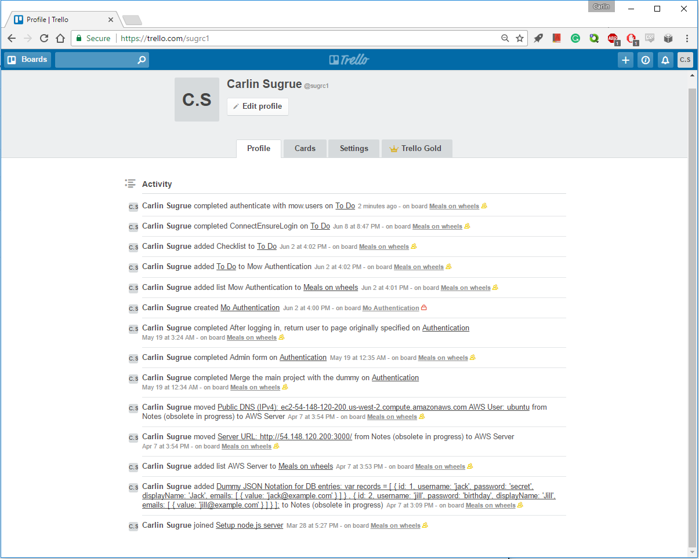
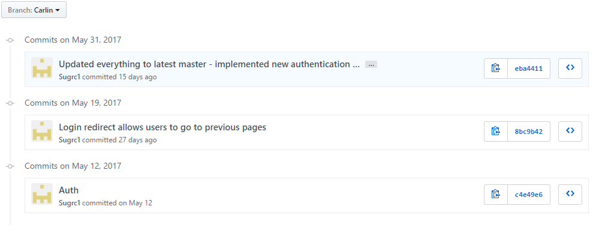
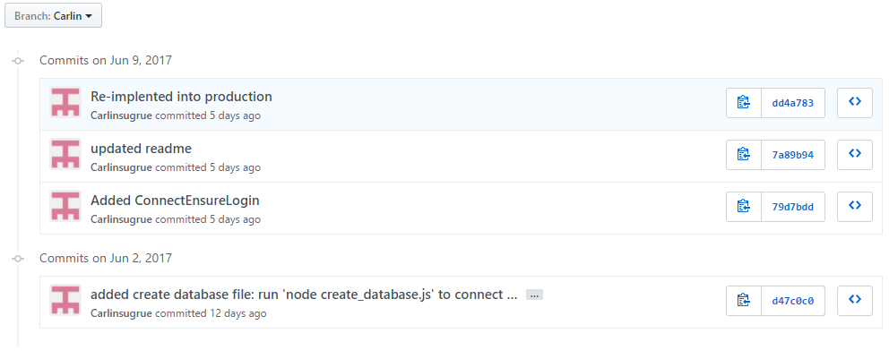
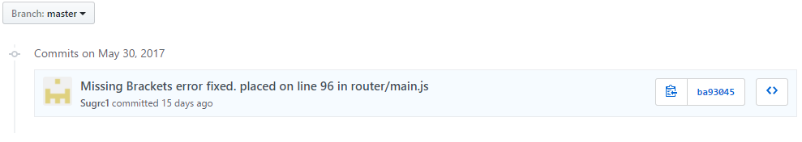
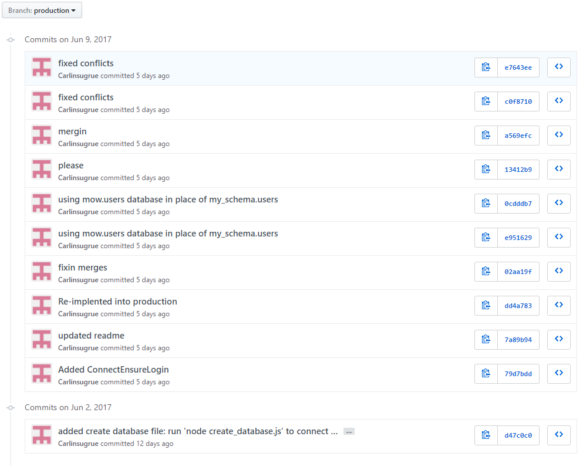
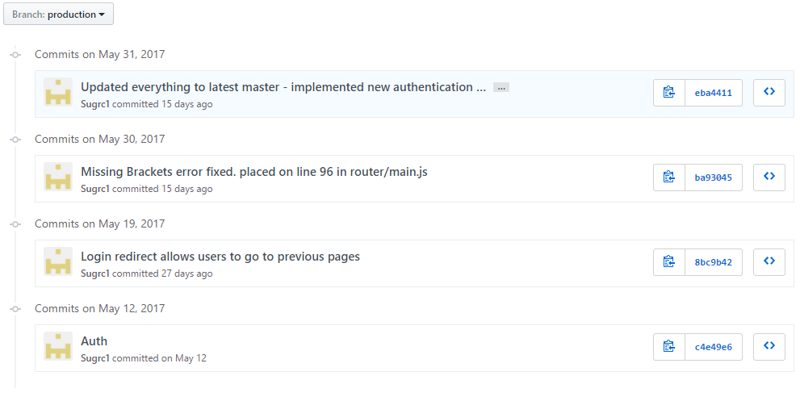
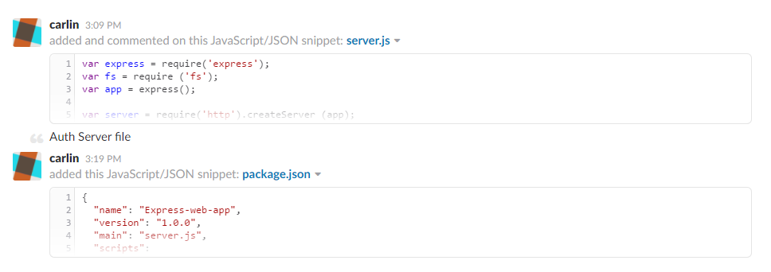
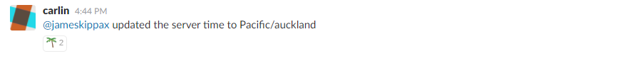

# My Semester

This semester we were set the task of co-ordinating the creation of an application for the local Meals on Wheels service, I knew this would be a challenge but I was ready for it! Wrong. Before things even started I had a big ol’ clash with one of my more involved papers, systems administration. Next, after entering that first class late, I have missed a wealth of information regarding the project itself and the positioning of people in the project to correctly compliment their skillset, I was placed on the opposite side of my spectrum. But in doing so I have come to realise that through perseverance, determination and teamwork daunting and complex tasks become simple. 

> ### "When eating an elephant take one bite at a time."
> ### _Creighton Abrams_

## My Work

My work has been to implement Authentication, but it was first and foremost trying to get a read on node.js in all its beauty. Initially many nights where spent watching tutorials on how node.js works and how to first launch a simple server application. There was no way I was going to get an authentication system working without first understanding the platform. Through all the coffee and drawn out nights I was able to understand (mostly) how all components of the node application interacted. Massive help and thanks to [Traversy Media](https://www.youtube.com/watch?v=U8XF6AFGqlc) and [Academind](https://www.youtube.com/watch?v=JH4qVqplC8E) for their extremely helpful videos.

With this base knowledge, I set out to find what authentication method node.js would use. Passport.js was the most implemented and popular solution. Honestly trying to wrap my head around implementing this module was completely mind boggling, mostly due to the fact the databases used in most examples where DBMS I was not familiar with, resulting in me getting completely confused and frustrated. After some time, me and Alex stumbled upon a dummy implementation that used a flat file as a database! Success! Things where looking up. Implementation into the master project seemed to go smoothly and I was starting to understand things a bit better. As time progressed extracting user information from the specific MOW MySQL database was the final key to a mostly realised authentication system. At this point Cade was a great help and we were finally able to use the mow.user table! Praise Jesus! and any other god that helped in the miracle!

Apart from dedicating most of my mental resources toward the authentication system, I felt I helped a great deal with other project members to test the various application variations on VM. Utilising my Linux knowledge also acquired from the clashing systems administration paper.

## My Main Challenges

Lorem ipsum dolor sit amet, consectetur adipiscing elit. Morbi a interdum magna. Suspendisse ut urna leo. In vulputate congue sapien non egestas. Ut consequat gravida sapien at vehicula. Donec id vulputate est. Suspendisse ullamcorper, augue ut ultricies imperdiet, dolor est cursus est, et mollis nisl elit suscipit metus. Quisque sit amet aliquet ex, et elementum dui. Nam odio tellus, feugiat ac diam vitae, lacinia aliquet lorem. Nam sollicitudin vitae lacus at sollicitudin. Fusce sed orci vel metus vehicula eleifend in porttitor massa. Praesent volutpat quam et arcu viverra, nec pretium ligula lobortis.

Maecenas tincidunt dignissim quam ac gravida. Nunc rutrum congue facilisis. In maximus, nunc eu lacinia facilisis, urna felis lacinia leo, in venenatis tellus risus id sem. Orci varius natoque penatibus et magnis dis parturient montes, nascetur ridiculus mus. Integer maximus mauris id tellus bibendum iaculis. Donec cursus suscipit diam, eget suscipit sapien finibus vitae. Donec at vulputate metus, in bibendum purus. Suspendisse potenti. Vestibulum nec sem sit amet nisi auctor laoreet ac nec urna. Maecenas pulvinar augue a sem molestie, a rhoncus nisi ornare. Maecenas a imperdiet ipsum. Ut et justo at metus ultrices pellentesque a vel urna. Pellentesque sit amet urna vel nisl scelerisque venenatis. Vestibulum ullamcorper eu ex ac faucibus.

## Some of my contributions

- ###     Trello
  - 
  
- ###     Git
  - 
  - 
  - 
  - 
  - 
  - 

- ###     Slack
  - 
  - 
